<div align="center">


<i>Material recomendado pela Maia Produção de Softwares</i>
</div>

<h2> 1. Organizações Financeiras </h2>

 <h3>1.1 O que é e para que serve uma organização financeira ?</h3>
<p>Um dos hábitos mais importantes para manter a organização financeira é fazer um controle mensal de seu fluxo de caixa. Para isso o JuFinanceiro conta com o modelu de Organizações Financeiras, é preciso ter clareza não apenas sobre o valor do seu salário líquido (e outras fontes de renda mensais), mas também sobre o seu custo de vida e principais gastos.
 <h3>1.2 Como criar uma conta no JUFinanceiro ? </h3>

 <p align="center">
  
</p>

Acesse  página oficial do JuFinanceiro [disponível aqui:](https://financeiro.homolog.janelaunica.com.br/#/login)


🗂 **Nesse tutorial iremos ver:**
<ul>
    <li>Introdução</li>
    <li>Setup do ambiente</li>
    <ul>
        <li>Download de tudo que precisa</li>
        <li>Configuração Windows</li>
        <li>Configuração Linux</li>
        <li>Configuração Mac</li>
        <li>Setup simplificado para todos os SOs</li>
        <li>Instalação do Appium</li>
    </ul>
    <li>Appium Doctor: como validar se tá tudo configurado?</li>
    <li>Checklist</li>
    <li>Iniciando o Appium</li>
    <li>Comandos ADB</li>
    <li>Emulando um dispositivo Android através do Android Studio</li>
    <li>Recursos específicos do Appium</li>
</ul>

___


## Parte 2 - conhecendo métodos do Appium

A parte 2 deste curso está relacionado a recursos e funcionalidades específicas do Appium. Os exemplos listados aqui serão em Python, mas quase todos os recursos usados aqui também existem em qualquer outra linguagem de programação que o Appium tenha suporte.

- Comandos sobre o dispositivo
- Interações
- Controle de recursos de rede
- Controle do sistema
___

🚧 Este documento sofrerá ajustes e complementos ao longo do tempo <i>&#128513;</i>

Iniciei a elaboração deste tutorial porque pra aprender essa ferramenta tive que recorrer a diferentes fontes e tive que praticar muito pra ter dicas, criar tutoriais, entender melhor a dinâmica, etc. Espero que este documento seja muito útil pra você e te incentivo a também compartilhar o que você for aprendendo <i>&#129304;</i>

___

<p align="center">

</p>

# Um pouco sobre Appium

_Appium_ é uma ferramenta open-source e multi-plataforma (isso quer dizer que funciona em Windows, Linux e Mac) e cujo foco é de interações via UI em dispositivos móveis, possibilitando a automação de aplicações: nativas, híbridas e sites mobile para as plataformas Android e iOS.

Considero _Appium_ uma excelente ferramenta para quem quer começar a aprender automação em dispositivos móveis ou para quem já é da área de mobile e gostaria de se aprofundar mais sobre o assunto.


**Links importantes para esta seção:**

[Página oficial do Appium](http://appium.io)

[Página oficial do repo do Appium no GitHub](https://github.com/appium/)

Como dito mais acima, a finalidade do _Appium_ é testar aplicações em dispositivos móveis, e aplicações podem ser classificadas em três diferentes naturezas : nativas, híbridas e móveis. Qual a diferença entre elas?
  - **Nativas:** aquelas aplicações que foram desenvolvidas especificamente para Android ou iOS, ou seja, a partir de seus específicos SDKs.
  - **Híbridas:** aquelas que são desenvolvidas em HTML, CSS, JavaScript e que são compatíveis com qualquer plataforma (Android, iOS, Windows).
  - **Móveis:** aquelas que podemos acessar através de um link, via página web.

___

<p align="center">

</p>

Nesta seção vamos ver os passos para realizarmos o setup do ambiente para Windows, Linux e Mac. Todos os meus projetos faço utilizando o Mac, então tendo a passar informações mais detalhadas para este SO.


✨ **Uma dica muito importante:**

Digo o que fazer para cada sistema operacional, mas você também pode optar por uma configuração mais simples (e efetiva da mesma forma) e que vai te poupar de muito tempo e dor de cabeça - confie em mim :) Se você quiser ir por esse caminho, pode pular direto para o tópico "Forma simplificada para Windows/Linux/Mac". O mesmo procedimento é utilizado para qualquer sistema operacional.

# 📥 Download de tudo que vai ser necessário

Durante o nosso workshop vamos utilizar algumas ferramentas essenciais para a prática de automação. Baixe e instale as seguintes ferramentas, que são comuns para Windows, MAC ou Linux:
  - **Appium Desktop:** é a interface da ferramenta Appium que será o foco do nosso workshop. O download está [disponível aqui:](https://github.com/appium/appium-desktop/releases/latest)
  
  - **JDK (JAVA Development Kit):** https://www.java.com/pt_BR/download/ 

  - **Android Studio:** é um pacote do Android Studio que possibilita que possamos instanciar dispositivos móveis de várias configurações e modelos de forma emulada e em vários níveis de API. Para isso, é preciso baixar o Android Studio e, durante o setup, marcar a opção de instalar também o AVD: https://developer.android.com/studio/index.html?hl=pt-br

  
  Depois de fazer o download de todo o conteúdo, agora podemos avançar com o setup do ambiente. Podemos configurar as variáveis de ambiente à nível de sistema (abaixo eu deixo detalhado como fazer para cada SO) e também podemos fazer de maneira bem mais simplificada, onde explico melhor após o detalhe de setup para cada SO.
  
# Variáveis de ambiente - Mac:

Depois de realizadas as instalações do Appium Desktop, JAVA, Android Studio e da sua IDE, é hora de configurarmos as variáveis de ambiente para que seu sistema operacional identifique os processos  e as aplicações de forma mais rápida e prática.
Para isso, abra o seu terminal, identifique a localização de instalação dos pacotes e os exporte para a variável PATH.
Após identificar a localização de onde foi instalado o seu Android, copie o caminho da pasta.
Por exemplo, para macOS a localização normalmente fica em:

```bash
/Users/user_name/Library/Android/sdk
```

Então será a partir desta pasta que vamos identificar os outros caminhos necessários, como:
```bash
/Users/user_name/Library/Android/sdk/platform-tools
/Users/user_name/Library/Android/sdk/tools
/Users/user_name/Library/Android/sdk/build-tools
```

Quando você identificar estes caminhos em sua máquina, é hora de exportar esses valores para a variável PATH.
Para isso, confira se no diretório "/Users/user_name" existe o arquivo ".bash_profile".
Caso não exista, crie:
```bash
touch .bash_profile
```

O próximo passo é abrir o editor de texto do arquivo:
```bash
open -e ~/.bash_profile
```

Digite os comandos como sugere o exemplo a seguir e salve o arquivo:
```bash
export ANDROID_HOME=/your/path/to/Android/sdk 
export PATH=$ANDROID_HOME/platform-tools:$PATH 
export PATH=$ANDROID_HOME/tools:$PATH 
export PATH=$ANDROID_HOME/build-tools:$PATH 
export JAVA_HOME=/your/path/to/jdk1.8.0_112.jdk/Contents/Home 
export PATH=$JAVA_HOME/bin:$PATH
```

# Variáveis de ambiente - Windows:
                        Configurando o Java JDK 

1 - Vá até as Variáveis de Ambiente no Windows

2 - Adicione a seguinte variável com o respectivo valor e clique em OK

3 - Nome da variável: JAVA_HOME

4 - Valor da variável: C:\Program Files\Java\jdk1.8.0_121 

Atenção: o Valor da variável é ilustrativo. O diretório correto deve ser o local onde está instalado o JDK, podendo haver diferenças na versão (números após o jdk1.8.0)

6 - Selecione a variável PATH e clique em Editar...

7 - Clique no botão Novo e adicione o seguinte valor de variável %JAVA_HOME%\bin
Atenção: se a variável PATH não existir, crie a variável com o mesmo valor de variável.

8 - Feche todas as telas clicando no botão OK e abra o Prompt de Comando. Se ele estiver aberto, feche-o e abra um novo

9 - Digite, no Prompt de Comando a palavra java e pressione a tela ENTER

10 - Deve ser apresentado uma lista de opções (parâmetros) para o comando. A primeira linha possui o texto “Uso: java [-options] class [args...]

             Configurando o Android SDK 


1 - Abra o Android Studio

2 - Na tela inicial clique o item Configure e depois no item SDK Manager
Copie o caminho apresentado no campo Android SDK Location

3 - Vá até as Variáveis de Ambiente no Windows e:

4 - Adicione a seguinte variável com o respectivo valor e clique em OK
Nome da variável: ANDROID_HOME
Valor da variável: Diretório presente no campo Android SDK Location
5 - Selecione a variável PATH e clique em Editar...

6 - Clique no botão Novo e adicione o seguinte valor de variável
o %ANDROID_HOME%\tools

7 - Clique novamente no botão Novo e adicione o seguinte valor de variável
%ANDROID_HOME%\tools\bin

8 - Clique novamente no botão Novo e adicione o seguinte valor de variável
%ANDROID_HOME%\platform-tools
9 - Feche todas as telas clicando no botão OK e abra o Prompt de Comando. Se ele estiver aberto, feche-o e abra um novo

10 - No Prompt de Comando digite uiautomatorviewer e pressione ENTER
Uma janela com o título UI Automator Viewer deve ser apresentada. Feche a janela

11 - Ainda no Prompt de Comando digite adb e pressione ENTER

12 - Deve ser apresentado uma lista de opções (parâmetros) para o comando. A primeira linha possui o texto Android Debug Bridge version

# Variáveis de ambiente - Linux:
A configuração de variáveis de ambiente para Linux funciona de forma muito semelhante a do Mac. Basta que vc identifique o caminho exato de instalação do JDK e do Android e aplicar (através de export) os caminhos no seu arquivo de configuração global, que neste caso é o ~/.bashrc

Por exemplo, para Linux a localização normalmente fica em:

```bash
/Users/user_name/Library/Android/sdk
```

Então será a partir desta pasta que vamos identificar os outros caminhos necessários, como:
```bash
/Users/user_name/Library/Android/sdk/platform-tools
/Users/user_name/Library/Android/sdk/tools
/Users/user_name/Library/Android/sdk/build-tools
```

Quando você identificar estes caminhos em sua máquina, é hora de exportar esses valores para a variável PATH, como sugere o exemplo a seguir:

```bash
export ANDROID_HOME=/your/path/to/Android/sdk 
export PATH=$ANDROID_HOME/platform-tools:$PATH 
export PATH=$ANDROID_HOME/tools:$PATH 
export PATH=$ANDROID_HOME/build-tools:$PATH 
export JAVA_HOME=/your/path/to/jdk1.8.0_112.jdk/Contents/Home 
export PATH=$JAVA_HOME/bin:$PATH
```

✨ **Dica - Windows/Linux/Mac:**
Para identificar onde está a sua pasta para JAVA_HOME, é só usar o seguinte comando no terminal:
```bash
which java
```
Deverá ser retornado o caminho até seu pacote JAVA.

✨ **Dica 2 - Linux/Mac:**
Para evitar que suas variáveis de ambiente percam os valores, salve o conteúdo da variável no seu arquivo bashrc (Linux) ou bash_profile (macOS). Após salvar os valores, não esqueça de "compilar" o arquivo para as mudanças serem refletidas:
Para macOS:
```bash
source ~/.bash_profile
```

Para Linux:
```bash
source ~/.bashrc
```

# Forma simplificada para Windows/Linux/Mac
Se você quiser simplificar a sua configuração de ambiente, é só utilizar o atalho de configuração do Appium e inserir manualmente os caminhos para as suas variáveis ANDROID_HOME e JAVA_HOME. Esta etapa é bem mais simples e da mesma forma efetiva para uso da ferramenta. Basta seguir os passos adiante:

Abra sua ferramenta Appium Desktop e clique no botão "Edit Configurations".
<p align="center">

</p>

Quando você clicar em "Edit Configurations", um popup vai abrir com 2 campos: ANDROID_HOME e JAVA_HOME. É só você identificar estes caminhos na sua máquina (no setup de configuração para cada SO eu deixei comandos e dicas para obter estes valores), copiar e colar nestes campos e em seguida clicar em "Save and Restart". Pronto, configuração do Appium realizada com sucesso :)

<p align="center">
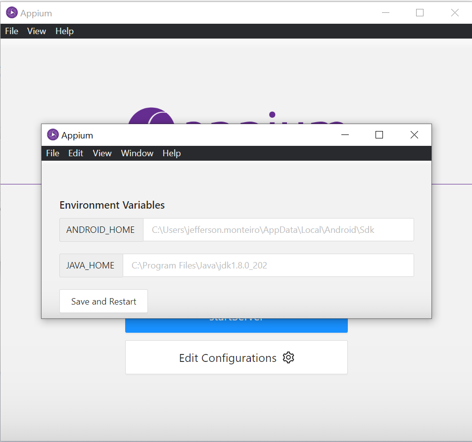
</p>

___

# Instalando o Appium

A instalação do Appium é bastante simples e não requer configuração adicional - além da do Android e do JDK. Basta baixar o Appium Desktop na página oficial do Appium(como no link do começo do documento) ou via linha de comando através do terminal:

```bash
npm install -g appium
```
**ATENÇÃO:** Não instale o Appium com sudo.

✨ **Dica - O que é npm?**

Npm é o gerenciador de downloads para pacotes node.js. 

___

<p align="center">

</p>

# Como validar se tudo tá configurado ou se falta algo?

Uma funcionalidade bem legal que o Appium oferece é o pacote <em>Appium-doctor</em>, cuja finalidade é conferir o checklist necessário para que seu ambiente funcione. Caso algo esteja faltando, o Appium-doctor te lista exatamente o que falta. Ele também confirma o que tá configurado como esperado. Para instalá-lo, é só instalar o pacote npm no seu terminal:

```bash
npm install -g appium-doctor --android
```

✨ **Dica:**
Estamos usando a flag **--android** para indicar a plataforma que vamos usar o Appium. Caso fôssemos usar o iOS, usaríamos a flag **--ios--**.

Depois de instalado o <em>Appium-doctor</em>, é só fazer a chamada via terminal:

```bash
appium-doctor
```

Abaixo segue um exemplo de como é o retorno do <em>Appium-doctor</em> via terminal:
```bash
➜  bin appium-doctor
info AppiumDoctor Appium Doctor v.1.16.0
info AppiumDoctor ### Diagnostic for necessary dependencies starting ###
info AppiumDoctor  ✔ The Node.js binary was found at: C:\Program Files\nodejs\node.EXE
info AppiumDoctor  ✔ Node version is 16.15.1
info AppiumDoctor  ✔ ANDROID_HOME is set to: C:\Users\jefferson.monteiro\AppData\Local\Android\Sdk
info AppiumDoctor  ✔ JAVA_HOME is set to: C:\Program Files\Java\jdk1.8.0_202
info AppiumDoctor    Checking adb, android, emulator
info AppiumDoctor      'adb' is in C:\Users\jefferson.monteiro\AppData\Local\Android\Sdk\platform-tools\adb.exe    
info AppiumDoctor      'android' is in C:\Users\jefferson.monteiro\AppData\Local\Android\Sdk\tools\android.bat     
info AppiumDoctor      'emulator' is in C:\Users\jefferson.monteiro\AppData\Local\Android\Sdk\emulator\emulator.exe
info AppiumDoctor  ✔ adb, android, emulator exist: C:\Users\jefferson.monteiro\AppData\Local\Android\Sdk
info AppiumDoctor  ✔ 'bin' subfolder exists under 'C:\Program Files\Java\jdk1.8.0_202'
info AppiumDoctor ### Diagnostic for necessary dependencies completed, no fix needed. ###
```

Tudo que estiver acompanhado do símbolo **✔** significa que está instalado corretamente.
Tudo que estiver acompanhado do símbolo **✖** significa que *NÃO* está instalado ou identificado. Esses casos você deve ajustar.

O pacote do **Xcode** é específico para iOS, então, para Android, não devemos nos preocupar.

___
# Checklist de tudo o que fizemos até agora

Se você chegou até aqui, significa que provavelmente o seu setup está pronto e agora você já pode usar todos os recursos do Appium! Só para checar, instalamos e configuramos:
- Appium Desktop **✔**
- Android Studio (pacote AVD) **✔**
- JAVA **✔**
- IDE **✔**
- Configuração de variáveis de ambiente **✔**

___

<p align="center">

</p>

# Iniciando com o Appium

Depois de tudo configurado, é hora de iniciarmos com o Appium Desktop.
Assim que abrimos o Appium Desktop, esta é a carinha inicial que temos contato:

<p align="center">

</p>

Observe que de cara já temos 2 campos preenchidos:<br>
**HOST:** 0.0.0.0<br>
**Port:** 4723

Estes são valores padrões do Appium e indicam que sempre que você começar a realizar requisições (lembra que o Appium é baseado em servidor HTTP?), o Appium irá utilizar o Host 0.0.0.0 e o serviço irá funcionar na porta 4723. Caso você queira mudar estes valores (quando algum outro serviço já está alocado para esta porta, por exemplo), é só você realizar a customização dessa configuração manualmente clicando no botão **Advanced**, que fica ao lado do já selecionado **Simple**. Você também pode salvar suas configurações personalizadas e exportá-las através do button **Presets**. 

Dica para quem for usar o google chrome para automatizar, é preciso informar o caminho do chromedrive em **Advanced** > ChromeDriver Binary Path


<p align="center">
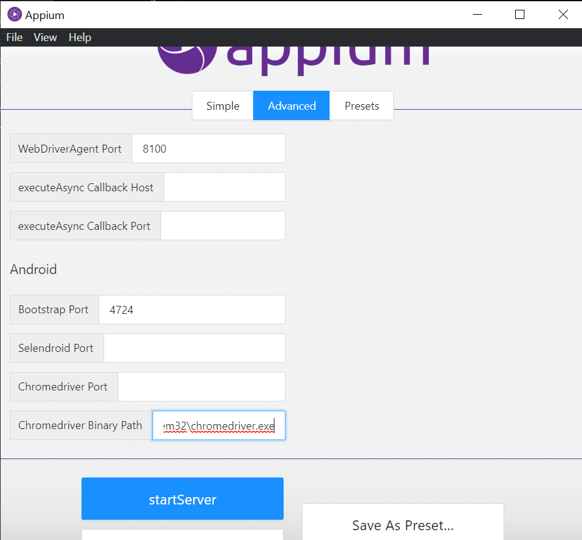
</p>

O ChromeDriver precisa estar na mesma versão que o navegador do dispositivo
para consultar a versão no dispositivo vá em Ajuda e feedback > nos 3 pontinhos no canto superior direito > informações da versão 

<p align="center">
	
</p>

Para consultar as versões do ChromeDriver e baixar é só clicar [AQUI.](https://chromedriver.chromium.org/downloads)

Explicada essa tela inicial, agora podemos clicar em **Start Server** e observar já a segunda tela do Appium: uma escuta da chamada HTTP. Observe que ele indica aí exatamente o endereço onde o serviço está sendo executado (que são inseridos nos campos de <i>Host</i> e <i>Port</i> da tela anterior, onde deixamos os valores padrões).

<p align="center">
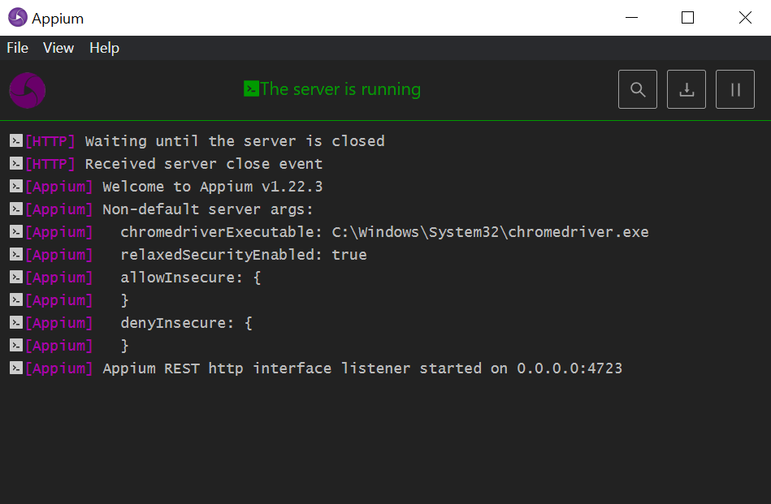
</p>

Agora podemos ir para o próximo passo, onde vamos começar iniciar uma sessão (essa é a expressão utilizada quando vamos iniciar o uso do Appium).

Nas versões antigas do Appium server o Appium Inspector já vinha integrado, vamos precisar baixar ele para fazer as configurações das capabilities e inspeções, [CLIQUE AQUI](https://github.com/appium/appium-inspector) para baixar e instalar.

<p align="center">
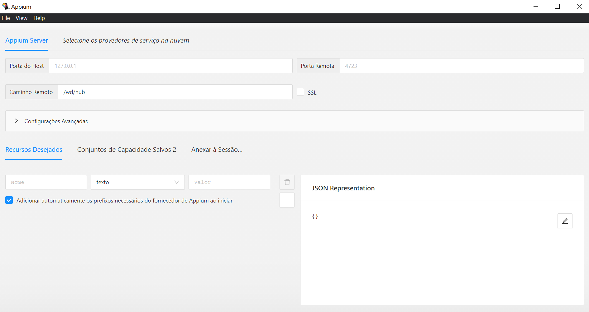
</p>

Ao abrir o Appium Inspector, agora podemos ver uma tela com vários campos para o Appium, mas aqui podemos seguir na aba <i>Appium Server</i>, que já vem escolhida por padrão. Observamos também os seguintes campos já preenchidos:<br>
**Remote Host:**  127.0.0.1<br>
**Remote Path:** /wd/hub<br>
**Remote Port:** 4327<br>

O **Remote Port** já falamos anteriormente. **Remote Host** tá com o valor de <i>localhost</i> para o serviço, mais uma vez você pode alterar caso já tenha algum serviço rodando local. Caso contrário, pode deixar esse valor mesmo. **Remote Path** também é um valor padrão do Appium e nunca precisei alterar, sempre deixo esse mesmo valor.

**Agora chegou o momento de aprendermos um dos pontos mais importantes quando começamos a usar o Appium: entender o funcionamento dos Desired Capabilities** (abaixo eu deixo o link oficial listando todos os valores que podemos usar nos desired capabilitites). <i>Desired Capabilities</i> pode ser grosseiramente traduzido por "Configurações desejadas". É onde você vai informar ao Appium o que é pra ele fazer exatamente.


Como citado mais acima, o Appium funciona através de requisições HTTP e, como padrão deste tipo de comunicação, utilizamos arquivos em JSON para indicar qualquer mensagem. O appium nos traz uma interface gráfica com campos de entrada de texto mas, após preenchermos os campos de texto, ao lado ele já converte o que digitamos em um arquivo JSON. Você pode editar diretamente no JSON ou usar o campo de texto, como quiser. As duas formas funcionam bem.

Para iniciarmos uma sessão vamos precisar de pelo menos 2 campos, que são:

```bash
{
    "appium:automationName": "UiAutomator2",
    "platformName": "Android",
    'appium:deviceName': '<InserirOnomeDoSeuDispositivoAqui>'
    "appium:udid": "<IDadb>"
}
```


# Configurando o dispositivo real para teste

Desbloqueie seu celular Android

Vá em configurações > sobre o dispositivo > informação do dispositivo ou status do telefone e clique até aparecer a mensagem de você é um desenvolvedor ou algo do tipo.

Agora vá na configurações > programador e ative a seguinte opção:

Depuração USB

Agora com as variáveis de ambientes configuradas e o celular desbloqueado vamos usar uma ferramenta chamada ADB(Android Debug Bridge)

O Android Debug Bridge (adb) é uma ferramenta de linha de comando versátil que permite a comunicação com uma instância de emulador ou com um dispositivo Android conectado. Ele facilita uma variedade de ações de dispositivo, como instalar e depurar aplicativos, e fornece acesso a um shell Unix que pode ser usado para executar diversos comandos em um emulador ou dispositivo conectado.


No terminal, você irá rodar do seguinte comando:
```bash
adb devices
```

<p align="center">
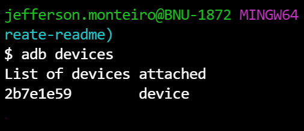
</p>

Esse comando irá lhe trazer a lista de todos os celulares e emuladores conectados ao seu computador, trazendo o udid do celular igual da imagem abaixo:


🚦 **Atenção:** “Não esqueça de conectar o celular no usb porque se não, não irá aparecer nada na lista de devices”

Os nomes são bem intuitivos, e aí estou criando um dicionário com a chave em <i>'automationName'</i> é a estrutura de automação utilizada para Android 6 ou supeior, para mais detalhes, consulte [AQUI.](https://github.com/appium/appium-uiautomator2-driver#capabilities) <i>'platformName'</i> para indicar a plataforma que irei utilizar, que pode ser: Android, Windows, iOS. 
Já o identificador do dispositivo móvel iremos inserir em <i>'deviceName'</i> e o <i>udid</i> que podemos obter esses valores através do comando adb <i>'adb devices'</i> que já explicamos mais acima. Assim fica um exemplo de preenchimento destes campos básicos e ao lado já o retorno do conteúdo em JSON:

<p align="center">
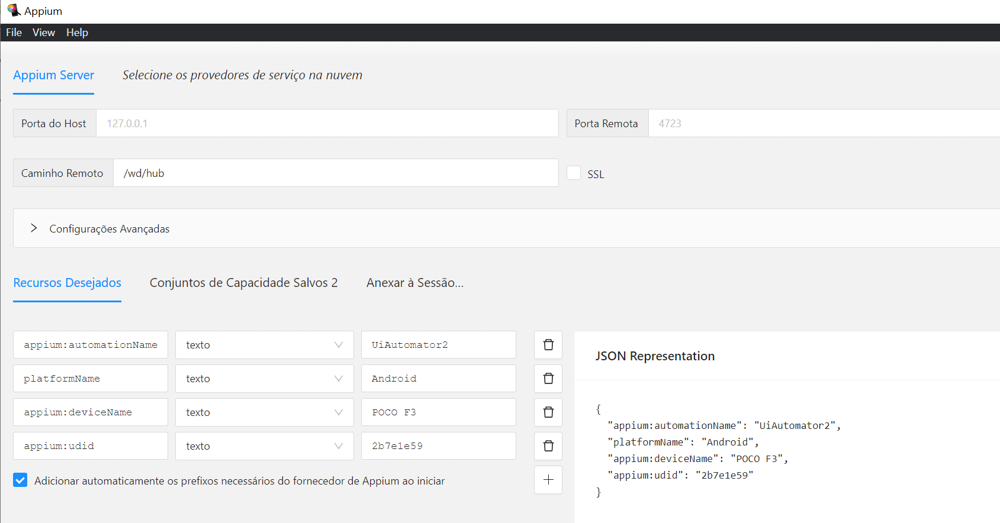
</p>


**Página oficial do Appium listando todos os Desired Capabilities:** <br>http://appium.io/docs/en/writing-running-appium/caps/

___
# Configurando um dispositivo Android emulado através do Android Studio
Podemos usar o Appium em dispositivos reais, dispositivos emulados ou até mesmo em farms de dispositivos da Amazon, que funcionam com o mesmo conceito de computação em nuvem, onde você aloca recursos sob demanda e paga apenas o que for consumido.
Uma outra opção que podemos utilizar são os dispositivos emulados para a realização dos nossos testes. Isso nos dá grande versatilidade pela possibilidade de escolher o tipo de dispositivo e a versão de Android que iremos utilizar. Desta forma, é possível validar o mesmo apk em cenários diversos apenas alterando configurações, onde atingimos uma característica muito forte no Android que é a granularidade de versões: https://developer.android.com/about/dashboards?hl=pt-br

**Antes de tudo... o que é um dispositivo emulado?**<br>
É a instanciação (criação) de um dispositivo que simula um celular real, só que ele é emulado a partir dos recursos da sua máquina. É como se fosse uma máquina virtual, só que o Sistema Operacional (imagem) utilizado será alguma versão oficial do Android e o formato da máquina será uma réplica do celular de verdade, inclusive sob aspectos de tamanho das telas.

Vamos utilizar um recurso do próprio <i>Android Studio</i> para instanciarmos nosso dispositivo emulado: o <i>Android Virtual Device Manager</i>. Para acessá-lo, basta abrir o seu <i>Android Studio</i> e seguir até o seguinte ícone:

<p align="center">
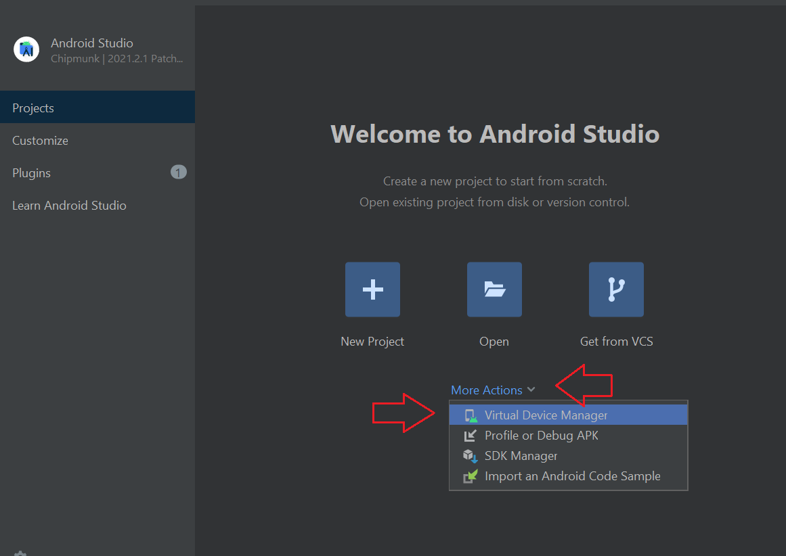
</p>

Assim que você clicar no ícone do <i>Virtual Device Manager</i>, o seguinte popup vai abrir e você vai clicar em <i>+ Create Device...</i> para criar o seu novo dispositivo emulado, como na imagem a seguir:

<p align="center">
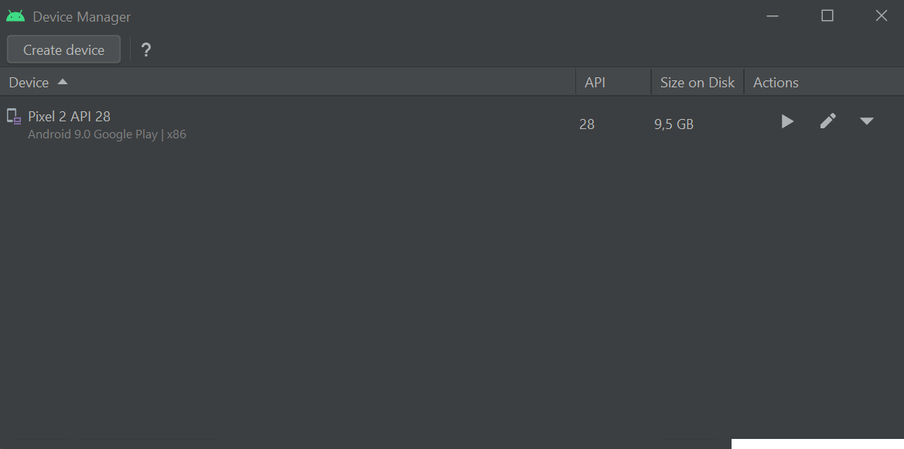
</p>

Nesta nova tela, podemos escolher qual o tipo de dispositivo que queremos: TV, Phone, Wear OS, Tablet e Automotive; além da marca do produto, tamanho e resoluções de tela e também a densidade. Você pode emular qualquer variação desses produtos. Vamos focar em **phone** e eu gosto bastante de utilizar o produto <i>Pixel 2</i> em meus estudos, já que é um produto da Google e que tem um ótimo tamanho de tela, mas você fique à vontade de utilizar a variação de Phone que você achar melhor. Escolhido isso, é só clicar em <i>Next</i>.

<p align="center">
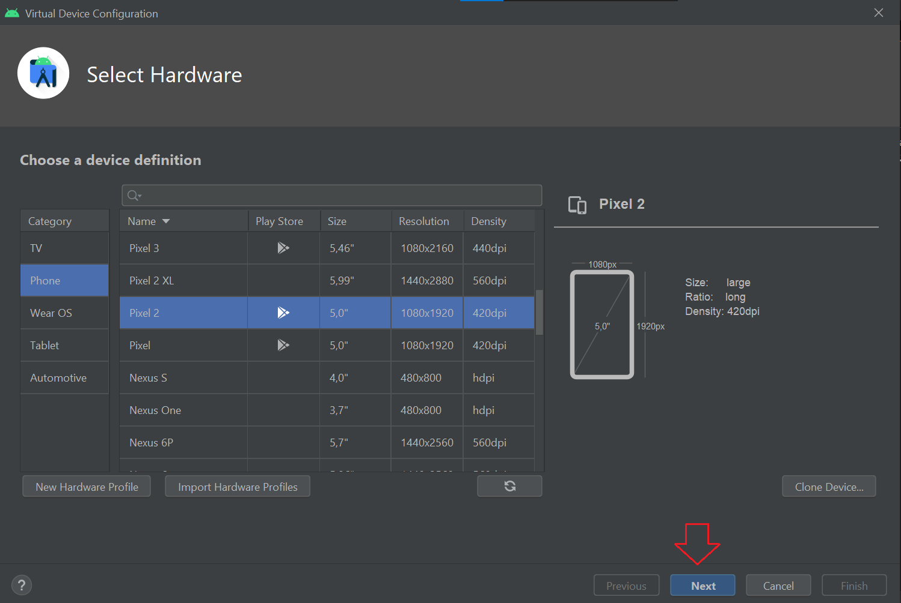
</p>

Escolhido o produto que você quer prosseguir em seus estudos, agora é hora de escolher a versão do Android que você irá emular em seu produto. Veja que existe uma lista com várias versões anteriores do Android disponíveis para download. Iremos testar com o **Android P**, que é minha versão mais estável e grande compatibilidade com apps. Vou prosseguir nos testes com o Android P, mas fique à vontade para baixar a versão que você quiser. Ah, você pode criar dispositivos com versões de Android diferentes e ir usando pra ver qual versão você acha que atende melhor às suas necessidades. Caso a imagem ainda não esteja disponível para você, clique em download. Caso já tenha baixado, é só selecionar a imagem e clicar em <i>Next</i>

<p align="center">
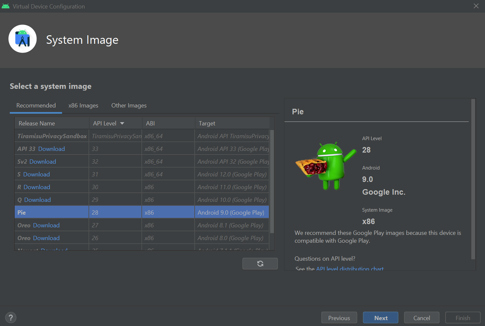
</p>

Estou usando a seguinte configuração para meu dispositivo emulado:<br>
**Modelo de Device:** Pixel 2<br>
**Versão de Android:** Android P<br>

Dispositivo criado, tente realizar algumas ações nele como abrir aplicativos, utilizar botões de acesso como Home, Back, Recent Apps.

Um mundo de possibilidades que também podemos explorar com dispositivos Android é que podemos usar comandos ADB no nosso dispositivo emulado e já ver que ele responde da mesma maneira que um dispositivo real. A próxima seção vai falar um pouco sobre isso.

**Lembra quando falamos dos Desired Capabilities?** Agora podemos adicionar a configuração para abrir o emulador em conjunto com a requisição de servidor do Appium. 
Faremos isso a partir do nome que demos ao Virtual Device que cadastramos anteriormente. Assim:

<p align="center">
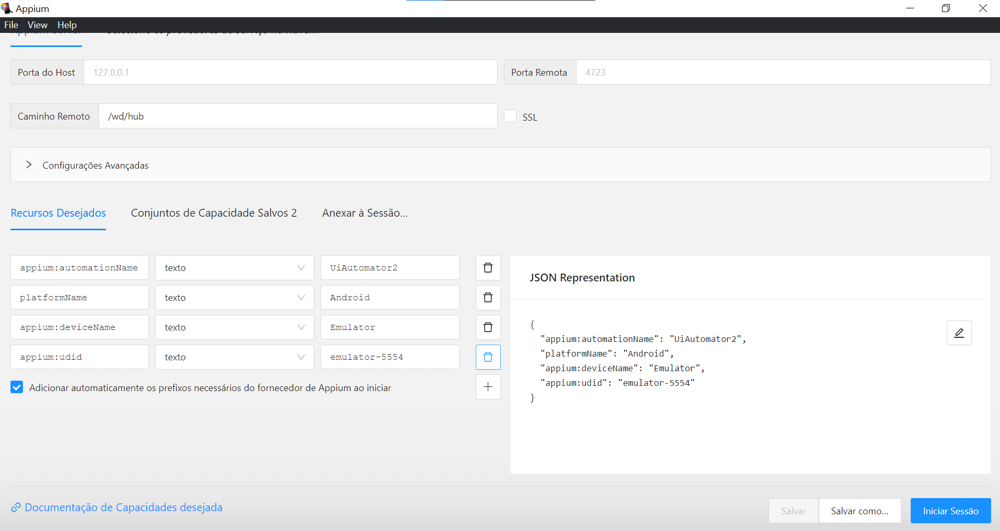
</p>

Daí é só iniciar a sessão e por a mão na massa.

Agora podemos testar tanto no emulador quando no dispositivo Android real.
